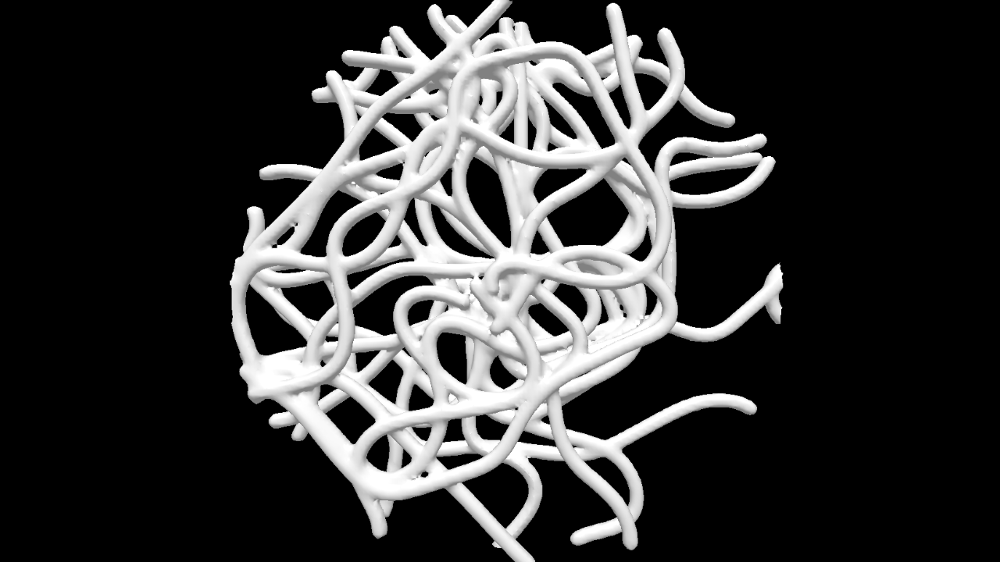

# volume-brush

Volumetric brush implementation, heavily inspired by (and adapted from) [toxiclibs](http://toxiclibs.org/docs/volumeutils/toxi/volume/VolumetricBrush.html).

<p align="center"></p>

## Installation

`npm i volume-brush`

## Usage

```js
const createVolume = require("volume-brush");

// create volume to work with
const volume = createVolume([128, 128, 128], [100, 100, 100]);

// leave a mark in 3d space of size `10`
volume.brush([50, 50, 50], 10);

// do something with the mesh
const mesh = volume.calculateMesh();
```

## Running Examples

1. `git clone` this repo
2. `cd examples`
3. `npm install && npm start`
4. `open http://localhost:3000`

Examples can also generate OBJ files by using `npm run export`.

## API

### `const volume = createVolume(dims, [size])`

Creates the sparse voxel octree, params:

- `dims` - 3d vector describing the actual voxel octree dimensions
- `size` - scaled size that can be used with `brush`, defaults to `dims` if not provided

#### `volume.brush(position, radius, [density], [brushMode])`

- `position` - 3d vector describing center of the brush, uses `size` coords provided to `createVolume`
- `radius` - radius of the brush-sphere
- `density` - optional - density of the volume, values less than `0.0` will "carve out" volume, defaults to `1.0`
- `brushMode` - one of three brush modes, (defaults to `"additive"`):
  - `"additive"`
  - `"peak"`
  - `"replace"`

#### `volume.calculateMesh()`

Calculates simplicial complex from current volume. Returns `{ cells, positions }`.
